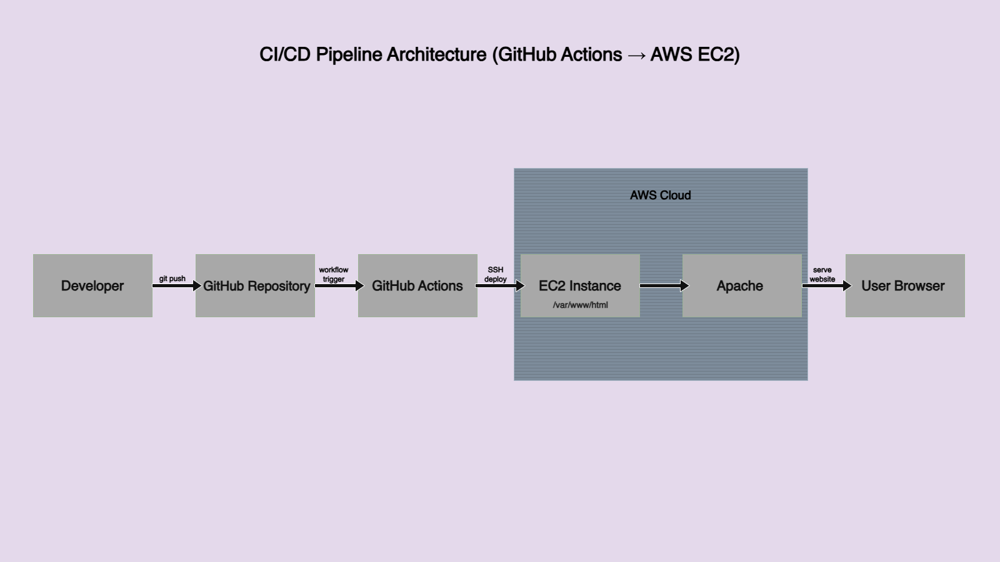
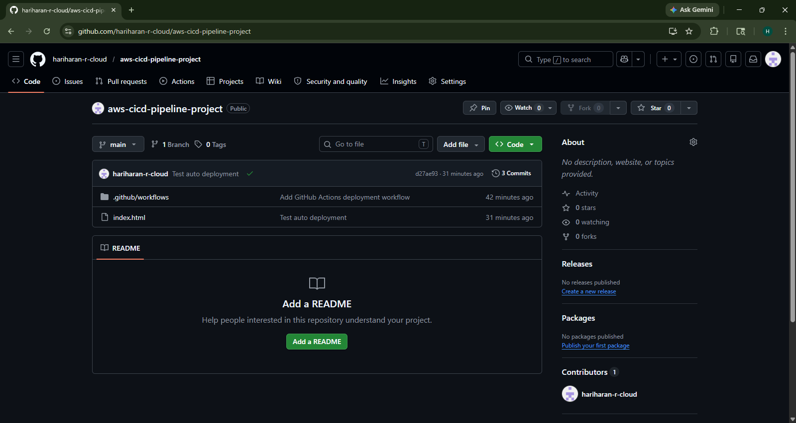
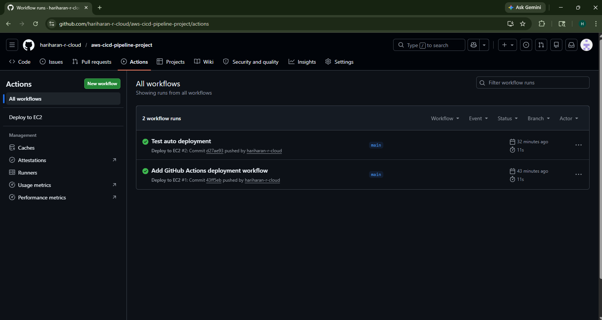
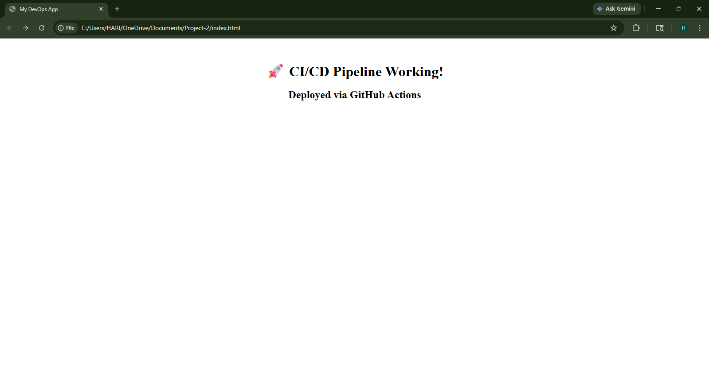
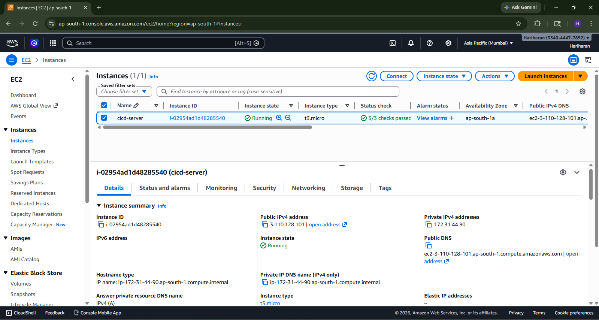
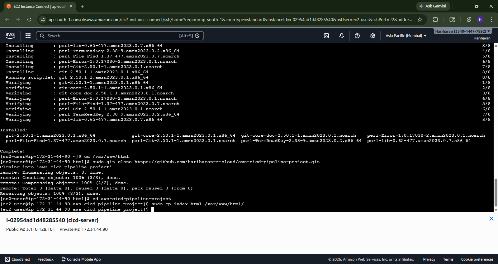
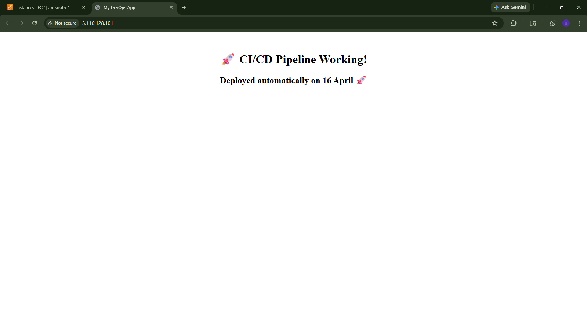
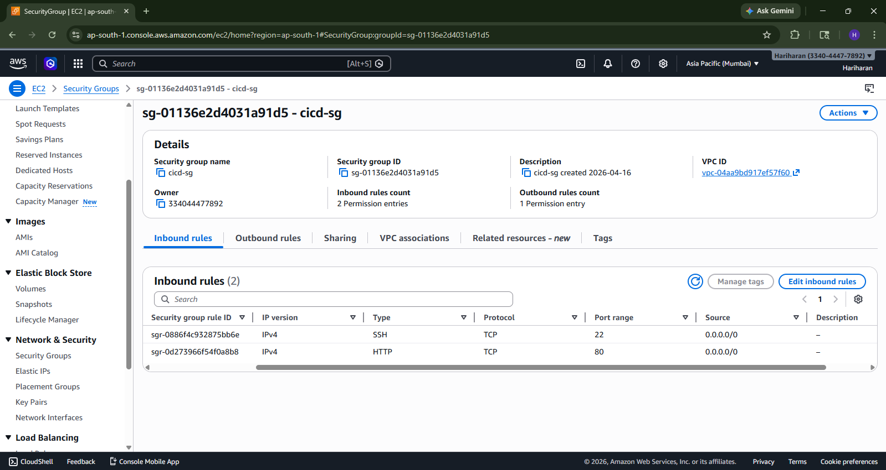

# 🚀 AWS CI/CD Pipeline using GitHub Actions & EC2

## 📌 Project Overview

This project demonstrates a complete **CI/CD pipeline** by automatically deploying a static web application to an AWS EC2 instance using GitHub Actions.

Whenever changes are pushed to the GitHub repository, the pipeline automatically connects to the EC2 server and deploys the updated application.

---
## 🏗️ Architecture Diagram

---

## 🛠️ Tech Stack

* **Cloud Provider:** AWS (EC2)
* **CI/CD Tool:** GitHub Actions
* **Version Control:** Git & GitHub
* **Web Server:** Apache (httpd)
* **OS:** Amazon Linux

---

## ⚙️ Architecture

1. Developer pushes code to GitHub
2. GitHub Actions workflow is triggered
3. Workflow connects to EC2 via SSH
4. Application is deployed to `/var/www/html`
5. Website is served via Apache

---

## 🔁 CI/CD Workflow

* Trigger: Push to `main` branch
* Steps:

  * Checkout repository
  * Connect to EC2 instance
  * Pull latest code
  * Deploy to Apache web server

---

## 📸 Screenshots

### 1. GitHub Repository Structure

### 2. GitHub Actions Workflow Success

### 3. Local Application Output

### 4. EC2 Instance Running

### 5. EC2 Terminal Deployment

### 6. Live Application Output

### 7. Security Group Configuration

---

## 📚 Key Learnings

* Setting up CI/CD pipelines using GitHub Actions
* Automating deployments to AWS EC2
* Managing secrets securely in GitHub
* Configuring Apache web server on EC2
* Understanding end-to-end DevOps workflow

---

## 🎯 Conclusion

This project showcases a real-world implementation of CI/CD by automating deployment workflows. It highlights how modern DevOps practices improve efficiency, reduce manual effort, and ensure faster delivery.

---

## 👨‍💻 Author

Hariharan R
